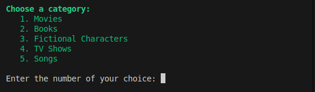
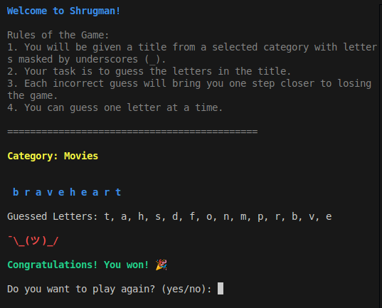

# Shrugman

Welcome to Shrugman, a guessing game where players try to guess a secret title by revealing letters. Incorrect guesses add pieces to a shrug emoji, and the game ends when the emoji is fully drawn or the title is guessed.

```bash
¯\\_(ツ)_/¯
```

## Project Overview

In Shrugman, the program selects a secret title, and players guess letters to uncover it. The game includes:

- **Masked Title:** Each letter in the title is represented by an underscore `_` until guessed.
- **Shrug Emoji:** Represents the number of wrong guesses with an emoji that grows as guesses are missed.
- **Categories:** Players can choose from various categories, including:
  - Movies
  - Books
  - Fictional Characters
  - TV Shows
  - Songs
- **Play Again Option:** After a game ends, players can choose to play another round and choose a new category.
- **Clear Console:** This game ises `console.clear()` to keep the game screen updated and tidy.
- **Chalk Integration:** It adds color to the console output for a more engaging visual experience.

## Game setup

To set up the Shrugman game, follow these steps:

1. Clone the repository:

   ```bash
   git clone https://github.com/yourusername/shrugman.git
   ```

2. Navigate to the project directory:

   ```bash
   cd shrugman
   ```

3. Install the required dependencies:

   ```bash
   npm install
   ```

4. To start the game, run:
   ```bash
   node index.js
   ```
5. Follow the prompts to select a category and start guessing.

## Game Examples

Here is a sequencial overview of Shrugman after the player chooses a category and wins the game.




## Thanks for reading. I hope you enjoy the game!
